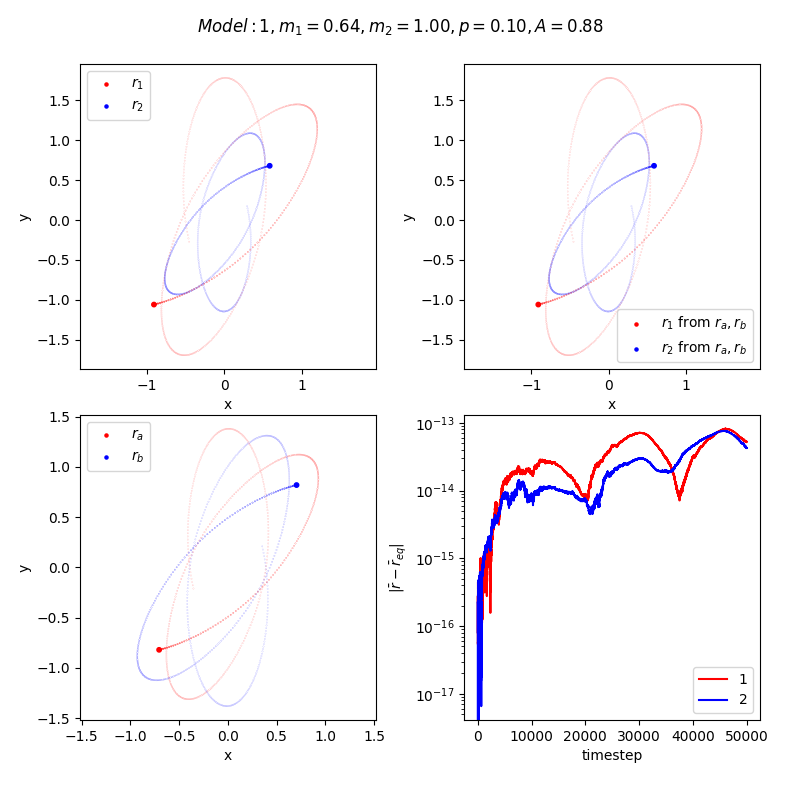

# CEEMS  
**C**oupled **E**quivalent **E**qual **M**ass **S**ystems for classical central force problems.  
A generalization of the classic equivalent one body problem.  

  

This program illustrates the CEEMS formalism via numerical simulations. The Lagrangian for motion of two particles of mass under a mutual central potential is given by
<p align="center"> </p>  

We would like to obtain an **E**quivalent Lagrangian of the form  
<p align="center"> </p>  
with  
<p align="center"> </p>  
<p align="center"> </p>  
where  is some **M**ass, **E**qual for both the particles, and it, along with  are constants that can only depend on the two masses. Thus the relationship between the two systems is linear, the potential is still central, and the two masses are **C**oupled (unlike the classic equivalent one body problem).  

The interpretation of this new system is as follows: Instead of obtaining equations of motion using Euler-Lagrange equations with the original Lagrangian, under a potential , with initial conditions ; we obtain equations of motion using the equivalent Lagrangian, under the same functional form of the potential, but with different coefficients (even those are identical in two of the models) and with different initial conditions .  

By equating the two Lagrangians by vectorial terms, a system of algebraic equations can be obtained and solved to determine the transformation parameters. In the three models coded in `CEEMS.py`, one corresponds to the case where a value for the equal mass is randomly chosen and the equivalent system evolves under the action of a force with scaled coefficients. The other two models correspond to the cases where the force coefficients are kept the same by a suitable choice of the equivalent equal mass. For systems where the force coefficients do not depend on mass (anything other than gravity basically), the choice is . For the case of Newtonian gravity, the choice is made so as to keep the value of G same in the equivalent "Universe". This leads to  (proportional to the Chirp mass of the binary system). Incredibly, this choice directly causes the leading order gravitational wave emission by these systems to be identical in amplitude, frequency and energy flux for **any** mass ratio. This is also one of the reasons why the CEEMS formalism doens't hold in General Relativity.  

Do let me know if you find any aplications for this.

Edit model parameters in `CEEMS.py`.  

To run the code,  
```
$ py CEEMS.py
```
